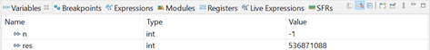
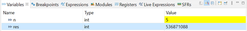
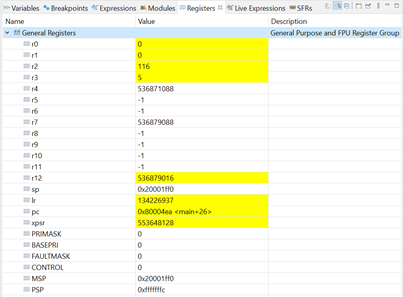
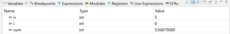
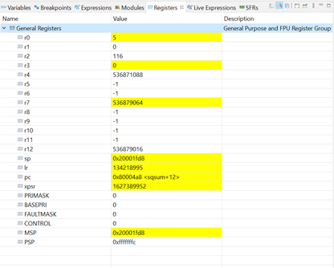
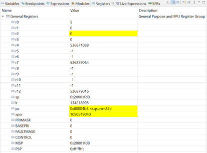
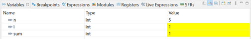
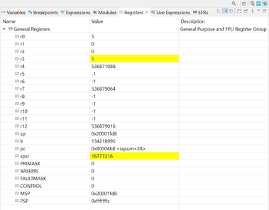
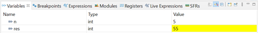
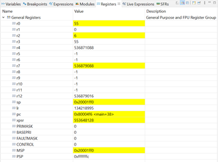

# Esercizio 2
### Scrivere in codice Assembly una funzione che esegue il calcolo della somma dei quadrati dei primi n numeri naturali. Si utilizzi il registro R0 per la variabile n, il registro R1 per conservare il risultato (variabile sum) ed un altro registro a scelta per conservare la variabile i che deve aumentare finono al valore n. Successivamente implementare la funzione in C e valutare, tramite modalità debug, quali registri vengono utilizzati ed in che modo.

## Svolgimento:
Si riporta di seguito il codice Assembly:

```assembly
    AREA main, CODE
    EXPORT __main
    ENTRY
__main PROC
    MOV r0, #5              ; input n
    MOV r1, #0              ; inizializzo la variabile sum
    MOV r2, #1              ; inizializzo la variabile i
    BL sqsum                ; aggiorna lr, salta all'indirizzo indicato. Il risultato viene restituito in r0!
    ENDP
    END

sqsum
loop MLA r1, r2, r2, r1     ; MLA Rd, Rn, Rm, Ra ----- Rd <- (Ra + (Rn × Rm))
    ADD r2, #1
    CMP r2, r0
    BLT loop                ; finche minore, torna a loop
    BX lr                   ; salta all'indirizzo indicato
```
Si riporta di seguito il codice C:

```c
int main(){
  int n = 5;
  int res = sqsum(n);
  return 0;
}

int sqsum(int n){
  int i = 0;
  int sum = 0;
  while(i<=n){
    sum += i*i;
    i++;
  }
  return sum;
}
```
<p align="center">













</p>
