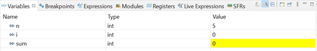

# Esercizio 2
### Scrivere in codice Assembly una funzione che esegue il calcolo della somma dei quadrati dei primi n numeri naturali. Si utilizzi il registro R0 per la variabile n, il registro R1 per conservare il risultato (variabile sum) ed un altro registro a scelta per conservare la variabile i che deve aumentare finono al valore n. Successivamente implementare la funzione in C e valutare, tramite modalità debug, quali registri vengono utilizzati ed in che modo.

## Svolgimento:
Si riporta di seguito il codice Assembly:

```assembly
    AREA main, CODE
    EXPORT __main
    ENTRY
__main PROC
    MOV r0, #5              ; input n
    MOV r1, #0              ; inizializzo la variabile sum
    MOV r2, #1              ; inizializzo la variabile i
    BL sqsum                ; aggiorna lr, salta all'indirizzo indicato. Il risultato viene restituito in r0!
    ENDP
    END

sqsum
loop MLA r1, r2, r2, r1     ; MLA Rd, Rn, Rm, Ra ----- Rd <- (Ra + (Rn × Rm))
    ADD r2, #1
    CMP r2, r0
    BLT loop                ; finche minore, torna a loop
    BX lr                   ; salta all'indirizzo indicato
```
Si riporta di seguito il codice C:

```c
int main(){
  int n = 5;
  int res = sqsum(n);
  return 0;
}

int sqsum(int n){
  int i = 0;
  int sum = 0;
  while(i<=n){
    sum += i*i;
    i++;
  }
  return sum;
}
```

Si avvia la modalità di debug, confermata dal fatto che la scheda lampeggia. Il debugger si ferma alla funzione HAL Init(), le variabili visibili risultano essere come quelle riportate in Fig. 1

<p align="center">

</p>

Dove si può notare che le variabili, non ancora inizializzate, assumono valori random o assunti precedentemente. I registri assumono lo stato riportato in Fig. 2.

<p align="center">

</p>

Andando avanti con il codice, inserendo un primo breakpoint all'inizializzazione int n = 5, si ha il relativo aggiornamento del valore della variabile, come indicato in Fig.3.

<p align="center">

</p>

Anche i registri subiscono degli aggiornamenti, come riportato in Fig. 4, dove si nota che il valore della variabile n è stata salvata nel registro r3, mentre il registro program counter punta all'indirizzo dell'istruzione attuale, ovvero l'istruzione del main con un offset di 26. All'interno della funzione sqsum() che viene successivamente chiamata, si inserisce un breakpoint sull'inizializzazione delle variabili locali int i = 0 e int sum = 0. In questo caso si è passati all'interno della funzione, che avrà visibili solo le variabili passate come argomento e quelle locali definite al suo interno.

<p align="center">

</p>

Infatti, le variabili mostrate dall'IDE sono visibili in Fig. 5, mentre non compare la variabile res, la quale sarà aggiornata alla fine con il valore di ritorno della funzione. I registri sono aggiornati come in Fig. 6

<p align="center">

</p>

Da notare che il valore della variabile n salvata in r3 viene spostata in r0. Il link register (lr) indica l'indirizzo dell'istruzione che dovrà riprendere una volta ultimata la funzione, il registro r3 prende la variabile i e viene inizializzato a 0. Il pc si aggiorna, in quanto è entrato nella funzione sqsum, in particolare con un offset di 12.

<p align="center">

</p>

Si pone un altro breakpoint all'interno del loop realizzato con il while. Si riportano le variabili in Fig. 7 e i registri in Fig.8.

<p align="center">

</p>

Il registro r2, che contiene il valore di sum, risulta essere pari a zero. Nell'iterazione successiva, si incrementa i, da 0 a 1. Di conseguenza, il valore di sum viene aggiornato anch'esso (1*1)+0, come riportati in Fig. 9 e Fig. 10.

<p align="center">

</p>

<p align="center">

</p>

<p align="center">

</p>

r3 contiene ora il valore 1. Nell'iterazione successiva, si incrementa i, da 1 a 2. Di conseguenza, il valore di sum viene aggiornato anch'esso, (2*2+1). Così avverrà per ogni ciclo. Si avrà infatti che r3 conterrà il valore 5, mentre R2 il valore precedente. Nell'iterazione successiva, si incrementa i, da 2 a 3. Di conseguenza, il valore di sum viene aggiornato anch'esso, (3*3+5=14). Nell'ultima iterazione, si incrementa i, da 5 a 6. Di conseguenza, la condizione all'interno del while non è più verifcata, dunque si esce dal ciclo e si restituisce il risultato in uscita alla funzione.

<p align="center">

</p>

<p align="center">

</p>

Come visibile in Fig. 11, la variabile locale i non è più presente, mentre viene aggiornata la variabile esterna res con il risultato della funzione, ovvero l'ultimo valore di sum. Si evidenzia che il valore in r3 viene passato al registro r0 come valore di ritorno. Come visto, i primi quattro registri r0-r3 sono stati usati per passare i valori degli argomenti in una subroutine e per restituire un valore del risultato da una funzione.
