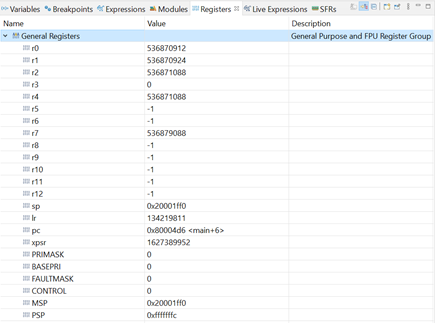

## Esercizio 2
Con la stessa logica utilizzata nell'esempio dell'esercitazione, a partire da quell'esempio abilitare altri due pin di ingresso su due GPIO della porta B, connettendoli ad altri due pulsanti, ed altri due pin di uscita su GPIO della porta A, connettendo altri due LED. Collegare logicamente ogni pulsante (ingresso) ad un LED (in uscita) e fare in modo che alla pressione di ogni pulsante si accenda/spenga un LED diverso. Testare il funzionamento dell'intero programma valutando anche le variazioni dei registri tramite interfaccia di debug. Si faccia attenzione ad utilizzare le opportune resistenze per la connessione di LED e pulsanti, come indicato.

## Svolgimento
Si avvia la modalità di debug, confermata dal fatto che la scheda lampeggia. Il debugger si ferma alla funzione HAL Init(). I registri assumono lo stato riportato in Fig. 1.

<p align="center">

</p>

La prima parte del codice contenuto nel main() è relativo alla configurazione dei registri necessari alla gestione dei GPIO. Si abilita il clock delle porte GPIOA e GPIOB:

```c
RCC->AHB1ENR |= 0x3; // 0x3 - 00000011 - 3
```
verificando il corretto settaggio tramite interfaccia di debug, come visibile in Fig. 2. Si configurano inizialmente i GPIO della porta A, come input e abilitandoli in modalita pull-up:

```c
/** GPIOA Configuration **/ // Used as INPUT
GPIOA->MODER &= ~(0x3F << 20); // Clear GPIOA10, 11 e 12, 0x3F = 00111111
GPIOA->MODER |= (0x00 << 20); // Set Input con [0x00]
// Pull-Up Mode su pin di input
GPIOA->PUPDR |= (0x01 << 20);
```

i valori assunti sono confermati da quelli riscontrabili tramite interfaccia di debug nei relativi registri. Si procede con la configurazione dei GPIO della porta A, come output, in modalità push-pull:

```c
/** GPIOA Configuration **/ // Used as OUTPUT
GPIOA->MODER |= (0x05 << 22); // Set Output [0x05 = 0101] GPIOA11 e GPIOA12
// Push-Pull output & Pull-up
GPIOA->OTYPER &= ~(0x03 << 11); // [0:15], con [0x1] ho out push-pull
GPIOA->PUPDR |= (0x05 << 22); // 0101
GPIOA->ODR |= (0x03 << 11); // Output high
```

<p align="center">

</p>

Stesso procedimento per i GPIO relativi alla porta B. Per questo esercizio di decide di utilizzare il metodo di polling per interrogare costantemente lo stato dei pulsanti e nel caso in cui viene rilevata una pressione, effettuare il toggle del led associato. Tale logica viene implementata in un ciclo infinito tramite un while(). Prendendo come esempio una coppia pulsante/led, se viene premuto il pulsante, il valore nel registro IDR relativo alla porta interessata diventa zero (perchè gli input sono normalmente alti, in quanto configurati con pull-up attivo): al verificarsi di questa condizione, si effettua un toggle sul valore del registro ODR di uscita del led associato. Per aumentare l'affidabilità delle letture, si implementa un semplice debouncing software tramite la funzione HAL Delay() fornita dal driver HAL.

```c
if(!(GPIOA->IDR >> 10 & 0x1)){ // PA_10
GPIOB->ODR ^= (0x1 << 10); // PB_10
HAL_Delay(400); // Simple deboucing
}
```
